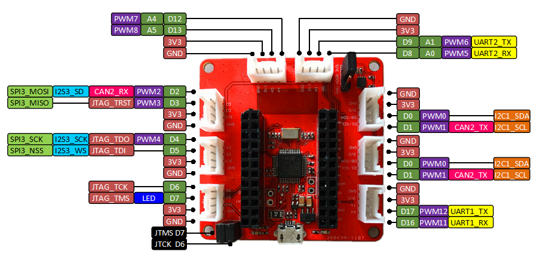

## Red Bear IoT Development Kit

The kit has two boards, the Duo board and the RBLink board. 

*** There is an issue with OSX 10.11, the RBLink will not work (with OpenOCD/libusb). As a workaround, please use MSD (drag & drop) method, OSX 10.10 or Windows at this moment.

## Red Bear Duo

The Red Bear Duo contains a ST32F205 MCU and AP6212A WiFi+Bluetooth combo module. The MCU has 1MB Flash and 128KB RAM, running at 120MHz. The wireless combo module built with BCM43438 A1 chip that works at 2.4GHz in frequency.

## WICED SDK

To use the board with WICED SDK 3.3.1:

1. Download Broadcom WICED-SDK-3.3.1 from:

   - http://community.broadcom.com/docs/DOC-2312

2. Unzip WICED-SDK-3.3.1 to your local file-system

3. Download and copy the files in this add-on package to the WICED-SDK-3.3.1 you just unzip and replace the original files

##  RedBear RBLink (Programmer) 

The programmer is based on STLink:

1. For Windows, go to ST official website to download and install the STLink driver:

   - http://www.st.com/web/en/catalog/tools/PF260219

2. No driver is required for OSX and Linux

3. Connect your RBLink USB to your PC using a micro USB cable

4. Open the command line terminal and change the working directory to WICED-SDK-3.3.1>

5. Type in "make rbl.rgb-RB_Duo JTAG=RBLINK download run" and press the Enter on the keyboard to begin build the project that under the folder "WICED-SDK-3.3.1\apps\rbl\rgb". More details about make usage please refer to the Makefile which under "WICED-SDK-3.3.1\"

* Remember to short the JTMS D7 and JTCK D6 jumpers (as the photo shows) before burning firmware to the board.

## Compilation

To test WiFi, you can use this command, it is a AP scanner demo:

"make snip.scan-RB_DUO_ES2 JTAG=RBLINK download run"

To test Blutooth LE, you can use this command, it is a proximity reporter demo:

"make snip.bluetooth.ble_proximity_reporter-RB_Duo_ES0 JTAG=RBLINK download run"

* if your board with AP6212 module, please use -RB_Duo_ES0 in the command and for AP6212A, please use -RB_DUO_ES2

## Drag-N-Drop Programming

RBLink supports drag and drop programming, so you can easily deploy your firmware.

Using this command to compile "make rbl.rgb-RB_Duo" in teminal, after that, it will create a file with ending "_MSD.bin", simply drag and drop it to the MSD drive via the RBLink.

## Other Tools

The RBLink is compatible with the STLink Utility
http://www.st.com/web/en/catalog/tools/PF258168
